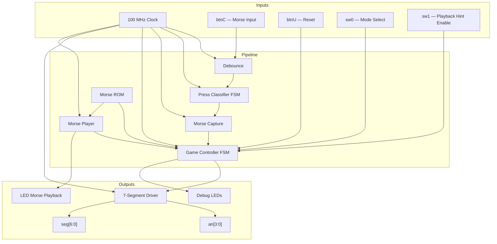

# Morse Code Training Game — Architecture Documentation

## Overview

This project implements a Morse Code Training Game on the **Basys 3 FPGA** board
(Artix-7 XC7A35T, 100 MHz clock). The game has two modes:

1. **Encoding Mode** — Display shows a level number (L01–L36). An LED blinks the
   Morse pattern as a hint (if enabled via sw[1]). The user reproduces the pattern
   using button presses.

2. **Decoding Mode** — Display shows a target character (A–Z, 0–9). The user must
   input the correct Morse code for that character.

---

## System Architecture



---

## Module Hierarchy

```
morse_game_top
├── debounce          (×2: morse button, reset button)
├── press_classifier  (classifies dot / dash / invalid)
├── morse_capture     (shift register + idle timeout)
├── morse_rom         (36-entry combinational ROM)
├── morse_player      (LED playback FSM)
├── game_controller   (central game logic FSM)
└── seg7_driver       (4-digit multiplexed display)
```

---

## Signal Flow

```
btnC → [debounce] → btn_morse_db → [press_classifier] → symbol_valid/bit/invalid
                                                              ↓
                                                    [morse_capture]
                                                    captured_pattern/length
                                                    input_done/invalid
                                                              ↓
                                                    [game_controller] ←→ [morse_rom]
                                                         ↓           ←→ [morse_player]
                                                    disp_char[3:0]        led_out
                                                         ↓
                                                    [seg7_driver]
                                                    seg[6:0], an[3:0]
```

### Data Flow Summary

1. **Button press** → Debounce → clean signal
2. **Debounced signal** → Press Classifier → dot/dash/invalid classification
3. **Classified symbols** → Morse Capture → shift register accumulates pattern, idle timer detects end-of-input
4. **Captured pattern + length** → Game Controller compares with ROM entry → determines pass/fail
5. **Morse Player** → In encoding mode, blinks LED to show the Morse pattern from ROM before user input is accepted
6. **Game state** → 7-Segment Driver → multiplexed display output

---

## Timing Parameters

All timing is derived from the 100 MHz system clock (10 ns period).

| Parameter | Value | Cycles | Constant Name |
|-----------|-------|--------|---------------|
| Debounce | 10 ms | 1,000,000 | `DEBOUNCE_TICKS` |
| Dot press min | 200 ms | 20,000,000 | `DOT_MIN` |
| Dot press max | 800 ms | 80,000,000 | `DOT_MAX` |
| Dash press min | 800 ms | 80,000,000 | `DASH_MIN` |
| Dash press max | 1.5 s | 150,000,000 | `DASH_MAX` |
| Idle timeout | 2 s | 200,000,000 | `IDLE_TIMEOUT` |
| Dot playback | 300 ms | 30,000,000 | `PLAY_DOT_TICKS` |
| Dash playback | 900 ms | 90,000,000 | `PLAY_DASH_TICKS` |
| Symbol gap | 300 ms | 30,000,000 | `PLAY_GAP_TICKS` |
| Display refresh | 1 ms | 100,000 | `REFRESH_TICKS` |
| Result display | 2 s | 200,000,000 | `DISPLAY_TICKS` |

---

## Morse Code Encoding

- **dot = 0, dash = 1**
- Stored MSB-first (first transmitted symbol is in the highest significant bit)
- Right-aligned in a 6-bit field
- Length field (3 bits) indicates how many symbols are significant

Example: A = `.-` → binary `01`, length 2 → stored as `6'b000001`

---

## Pin Assignments

| Signal | Pin | Description |
|--------|-----|-------------|
| clk | W5 | 100 MHz clock |
| btnC | U18 | Morse input (center button) |
| btnU | T18 | Reset (up button) |
| sw[0] | V17 | Mode: 0=Encoding, 1=Decoding |
| sw[1] | V16 | Hint: 1=Enable LED playback |
| seg[6:0] | W7,W6,U8,V8,U5,V5,U7 | 7-seg cathodes |
| dp | V7 | Decimal point |
| an[3:0] | U2,U4,V4,W4 | 7-seg anodes |
| led[15:0] | various | Debug LEDs |

---

## Display Format

| Situation | Display |
|-----------|---------|
| Encoding idle | `L01` to `L36` (digit 3 = 'L', digits 2-1 = level, digit 0 = blank) |
| Decoding idle | Target character (e.g., `"   A"`, `"   5"`) |
| Correct answer | `PASS` |
| Wrong answer | `ERR ` |
| All levels done | `donE` |

---

## Game Controller FSM

```
     ┌──────────┐
     │   IDLE   │ Display level/character
     └────┬─────┘
          │
     ┌────▼─────┐
     │RESET_CAP │ Hold capture reset
     └────┬─────┘
          │
    ┌─────┴──────┐ (encoding + hint)
    ▼            ▼
┌────────┐  ┌──────────┐
│PLAYBACK│  │WAIT_INPUT│ ◄── User enters Morse
└───┬────┘  └────┬─────┘
    │            │ input_done / input_invalid
    └────┬───────┘
         ▼
    ┌──────────┐
    │ EVALUATE │ Compare with ROM
    └────┬─────┘
    ┌────┴────┐
    ▼         ▼
┌───────┐ ┌───────┐ ┌───────┐
│ PASS  │ │ ERROR │ │ DONE  │
│2 sec  │ │2 sec  │ │2 sec  │
└───┬───┘ └───┬───┘ └───┬───┘
    │         │         │
    └────┬────┘    level→0
         ▼
       IDLE
```

---

## Debug LEDs

| LED | Signal |
|-----|--------|
| 0 | Debounced button state |
| 1 | Symbol valid (latched) |
| 2 | Symbol bit (0=dot, 1=dash) |
| 3 | Input done (latched) |
| 4 | Input invalid (latched) |
| 5 | Mode switch |
| 6 | Hint switch |
| 7 | Morse player LED |
| 11:8 | Current level [3:0] |
| 15:12 | FSM state |

---

## Design Constraints

- All outputs are **registered** (no combinational glitches)
- Synchronous design (posedge clk) throughout
- FSM-based control for classifier, controller, and player
- Meaningful parameterization for all timing constants
- Modular, reusable components

---

## File Structure

```
morse_game_verilog/
├── rtl/
│   ├── debounce.v
│   ├── press_classifier.v
│   ├── morse_capture.v
│   ├── morse_rom.v
│   ├── morse_player.v
│   ├── game_controller.v
│   ├── seg7_driver.v
│   └── morse_game_top.v
├── constraints/
│   └── basys3.xdc
└── docs/
    └── architecture.md
```

---

## Vivado Project Setup

1. Create new RTL project targeting **xc7a35tcpg236-1**
2. Add all `.v` files from `rtl/` as design sources
3. Add `basys3.xdc` from `constraints/` as constraints
4. Set `morse_game_top` as the top module
5. Run Synthesis → Implementation → Generate Bitstream
6. Program via USB-JTAG

---

## Verification Plan

### Synthesis Check
- Create Vivado project targeting **xc7a35tcpg236-1**
- Add all RTL sources and constraints
- Run synthesis and implementation

### On-Board Testing
1. Power on → verify default display (L01 in encoding mode)
2. If hint enabled, LED blinks Morse for level 1 (A = dot-dash)
3. Input Morse for 'A' (dot-dash) → verify PASS display → level advances
4. Switch to decoding mode → verify character display
5. Input wrong pattern → verify ERR display
6. Press reset → verify retry works
7. Complete all 36 levels → verify "donE" display → reset to level 0
